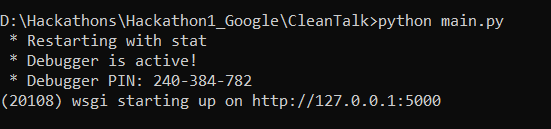
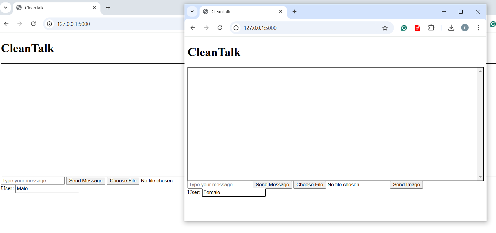

# CleanTalk
A clean talk, harassment-free chat platform for Google hackathon.

## Mission
The main objective of our application **CleanTalk** is to create a safer, harassment-free, and reliable chat application by proactively identifying and flagging inappropriate content before it reaches the recipient. This application is designed to support respectful communication across professional, educational, and gaming chat platforms, aiming to protect individuals—especially women and other vulnerable users—from experiencing online bullying, harassment, and unwanted advances without prior consent. Using Google's real-time AI-driven content moderation, CleanTalk fosters a more inclusive and respectful digital space where all users can engage confidently and safely, whether in professional, academic, or gaming contexts.
This application "Google Clean Talk" aims to fulfill objective 5.2 of the Goal 5 targets highlighted in [UN SDG 5](https://www.un.org/sustainabledevelopment/gender-equality/).


## Architecture
CleanTalk is a simple bidirectional communication web-based chat application that allows users to send text messages and images. However, it comes with an additional AI-based text moderation layer to flag potentially inappropriate messages. This application mainly makes use of Google's Gemini AI model to classify text messages as harassment or not.
The basic software architecture of the application can be explained as follows:

1) **Frontend**: The user interface is created with HTML, including input fields for text messages and image uploads. Messages and images are displayed in a message box. If a message is identified to be harassing, it is displayed in the sender's message box in red with a warning. Javascript and Socket.IO are used that enable real-time communication with the server. Users can send messages and images that are immediately transmitted to the server. Javascript also listens for responses from the server to display incoming messages and images.
2) **Backend**: At the backend, we have the Flask and Socket.IO server. The Flask application hosts the webpage and serves static files using Flask's routing and template capabilities. On the other hand, the Socket.IO server manages the exchange of text messages and images between the sender and receiver. We have two functions namely client_message and client_image to listen to events (that is text messages and images).
3) **Google's Gemini AI model**: Google's Gemini model is the heart of the application. The Gemini AI model is used to classify text messages to identify whether they contain harassment or inappropriate content. When a sender sends a message, the backend code calls the pre-trained **gemini-1.5-flash-8b** model to classify the message as either "harassment" or "non-harassment". If the model detects harassment, the message is flagged, and only the sender sees it with a red warning message. For now, the application is built considering only text as input, but later it could also be extended for other inputs such as images and video. 

## Getting Started
The CleanTalk application can be used by following three simple steps:

1) **Clone the Repository**
```bash
$ git clone https://github.com/Raghu-dev-pixel/CleanTalk.git
$ cd CleanTalk
$ pip install -r requirements.txt
```

2) **Run the Application**
```bash
$ python main.py
```

3) **Access the Application**
* If the script executes successfully, the Flask application will start in development mode and it is now possible to open the chat application in your web browser by visiting the address that will be displayed after the execution of the script for example "http://127.0.0.1:5000" as shown below:

* To simulate a conversation between two users (e.g., representing a male user and a female user), open two instances of the chat application, as illustrated below:
  


* Appropriate Conversations: Users can now exchange text messages just like in any other chat application. As long as the messages remain appropriate, they will be delivered to both the sender and the recipient:


* Inappropriate Conversations: If a message is flagged as inappropriate or harassing, it will not be delivered to the recipient. Instead, the sender will receive a warning message, as shown below:


## Project Description and Contribution to Gender Equality
**CleanTalk** is a simple chat application that creates a harassment-free digital communication environment by proactively identifying and flagging inappropriate or offensive content before it reaches the receiver. Built with a Python-based Socket.IO chat framework and integrated with Google's Gemini AI model, CleanTalk empowers users—especially women and vulnerable individuals—by providing a safer space to communicate, whether in professional, educational, or gaming settings. This application is also beneficial in customer-facing roles where women may encounter harassment from inappropriate or angry customers. With real-time content filtering, CleanTalk helps individuals engage in online conversations confidently and without fear of receiving unwanted messages or explicit content.

When it comes to the application's contribution toward gender equality, CleanTalk addresses the widespread issue of online sexual harassment, which is currently affecting several women across the globe. It aims to minimize psychological and emotional trauma by preventing harassing messages from reaching the user. This is important for women in professional environments where women are subjected to more violence.

The application contributes to gender equality in the following ways:

1) **Violence-Free Communication**: By filtering out inappropriate content, CleanTalk creates a safer digital environment where women and other marginalized groups can communicate without fear of harassment.

2) **Empowering Women in Customer-Facing Roles**: In roles where women often encounter abuse, CleanTalk provides a layer of protection, allowing them to focus on their responsibilities without the added burden of handling harassment.


Encouraging Equal Participation: By reducing the threat of harassment, CleanTalk encourages women to participate more freely and confidently in online communities and professional environments, supporting equal opportunities for career growth and digital engagement.

## Limitations and Future Work
1) The application can be deployed and executed only on a local machine. So to manage the "main.py", the user must have Python already installed. The application was tested with **python 3.9.11** and **Google Chrome**. It is however possible to implement the application also on cloud platforms such as Heroku or fly.io to make the application more real-time but these deployments are now such that they require the users to enter their credit card details and as of now since I am a student it was not optimal to implement a cloud-based solution.

2) The application has been designed to flag inappropriate text messages, as part of the future implementation we could also consider flagging violating images and videos by making use of **Google Vision API**.

3) When considering this application as a potential replacement for more advanced platforms like MS Teams, Zoom, or Telegram, continuous content monitoring could feel intrusive for users during more personal conversations. To address this, we could offer an optional feature that allows users to enable relaxed monitoring for specific personal chats.

## What Makes This CleanTalk Unique
CleanTalk offers several advantages and distinct differences compared to existing tools such as Perspective API:

1) **Pre Prevention**: Unlike Perspective API, which is typically used for analyzing content after it has been posted, CleanTalk is designed to flag inappropriate messages before they are delivered to the recipient. This proactive filtering protects users from seeing unwanted content altogether, rather than reacting after it’s already been shared.

2) **Focused on Harassment-Free Communication**: While existing applications and methodologies analyze text for toxicity, it does not specialize in filtering for specific scenarios like harassment in professional, educational, and customer service settings. CleanTalk, on the other hand, is designed specifically to prevent harassment in contexts where users—especially women—are often targeted, such as customer-facing roles or professional communications.

3) **Multimedia Support**: If CleanTalk image moderation could be incorporated along with text, it provides an extra layer of protection by filtering explicit images and other media. Perspective API primarily focuses on text analysis, so this added capability makes CleanTalk more comprehensive.

## Additional Information
The use of Google's Gemini API in the code requires the user to set and activate the API key explicitly. In my project, I have created the API key explicitly for this project and the demo, however, it can be replaced in the future to be able to accept the corresponding API key of the user.

